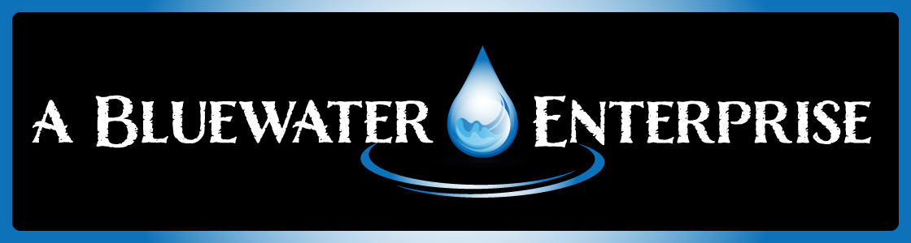

<!-- Multi-language Translation Status with Images -->
{{lang_status_bar}}



<!-- Badge Status Block -->
{{badge_status_block}}

<!-- Badges: Project Metadata and Status -->


---

# 🌊 Bluewater Central Script Repository

**The authoritative, versioned library of automation scripts and Git hooks for all Bluewater repositories.  
Ensures consistent standards, metadata management, and automated workflows across the entire Bluewater platform.**

> **Note:** Every documentation file begins with a machine-managed metadata block, bounded by HTML comment markers (`<!-- FILE HEADER:START -->` and `<!-- FILE HEADER:END -->`), which is automatically inserted and updated by project scripts.  
> For policy details, see the [File Header & Metadata Policy](./docs/en/architecture/status/header-policy.md).

---

## Overview

`bluewater-scripts` is the single source of truth for all automation, enforcement, and quality assurance scripts in the Bluewater ecosystem.  
By centralizing all critical automation here and integrating it as a submodule in all other Bluewater projects, we guarantee that every contributor, every repo, and every language tree is held to the same rigorous standards for metadata, file formatting, linting, and compliance.

> **Never hand-edit the language/status bar or metadata blocks!**  
> All language links, badges, and last-updated metadata are inserted automatically via scripts during commit, merge, or CI workflows.  
> Authors should use `{{language_status_bar}}`, `{{lang_bar}}`, and `{{last_updated}}` placeholders in all root and language root `README.md` files.

---

## Key Features

- **Canonical Git Hooks**
  - Pre-commit, commit-msg, and pre-push hooks for enforcing standards and compliance.
  - Automatic updates for metadata (copyright, date, legal).
  - Protection against documentation and code quality issues.
- **Automated Metadata Headers**
  - Every documentation file begins with a machine-managed metadata block, delimited by HTML comment markers, which is updated automatically by project automation.
- **Cross-Platform Support**
  - Scripts for Unix (bash), Windows (batch), and Python for portability.
- **Strict Linting and Formatting**
  - Wrappers for `markdownlint`, `yamllint`, and extensible for new linters.
- **Docs Structure Enforcement**
  - Shared logic for maintaining `/docs/{lang}/` directory structure and translation parity.
- **Centralized Maintenance**
  - One place for script updates—propagated to all other repositories as a submodule.
- **Transparency and Open Source**
  - All scripts are public, auditable, and improve trust across the Bluewater project.

---

## Repository Structure

```text
/
├── metadata-updater.sh      # Updates copyright, date, and legal headers.
├── markdown-lint.sh         # Runs markdownlint on staged/target files.
├── yaml-lint.sh             # Runs yamllint on staged/target files.
├── docs-structure-check.sh  # Enforces /docs/{lang}/ directory structure.
├── pre-commit               # Composite pre-commit hook; calls relevant scripts.
├── setup-hooks.sh           # Installs all supported hooks (Unix).
├── setup-hooks.bat          # Installs all supported hooks (Windows).
├── README.md                # This file.
└── ...                      # (Add more shared automation scripts here.)
````

*Each script includes inline comments and headers for detailed usage.*

---

## Installation & Usage

### **As a Submodule (Recommended)**

In your target repository (`bluewater-framework`, `bluewater-docs`, etc.):

```bash
git submodule add https://github.com/bluewatermvc/bluewater-scripts.git .shared-scripts
git submodule update --init --recursive
```

Update your `.githooks/pre-commit` (and other hooks) to call the shared scripts:

```bash
#!/bin/bash
set -e
$(git rev-parse --show-toplevel)/.shared-scripts/pre-commit
```

Or call specific scripts as needed.

**Always run**
`git submodule update --remote .shared-scripts`
to fetch updates from the canonical source.

### **Manual Usage**

All scripts are self-contained.
Refer to each script’s `--help` or top comment block for usage.

---

## Integration with Bluewater Projects

* **bluewater-framework:**
  Enforces PHP, PHPDoc, Markdown, YAML, and docs structure standards.
  All metadata and lint logic sourced from this repository.
* **bluewater-docs:**
  Enforces documentation and metadata standards, translation, and structure parity.

*All Bluewater projects reference and update this repository as the single source of automation truth.*

---

## Contribution & Governance

We welcome contributions to improve automation, reliability, or contributor experience.

* **Read:**
  [CONTRIBUTING.md](./CONTRIBUTING.md) (process and policy)
  [GOVERNANCE.md](./GOVERNANCE.md)
* **Fork & PR:**
  Use clear commit messages and submit focused pull requests.
* **Testing:**
  All scripts must be cross-platform, robust, and documented.

---

## Security & Compliance

* All scripts are version controlled and auditable.
* Do **not** include secrets or sensitive configuration.
* Logic is open for review and improvement by the community.

---

## License

Distributed under the [Open Software License (OSL 3.0)](./LICENSE)
or another OSI-approved license as specified.

---

## Acknowledgments

Maintained by the Bluewater Core Team.
Inspired by leading open-source automation practices and a commitment to project excellence.

---

{{last_updated}}
